# ORION Clinic — рабочее место врача

## Главная страница и выход (7 сентября 2026)

Откройте `/` или нажмите «Рабочий день» в боковой панели. Главная показывает
назначенные вам приёмы из БД за все даты: все, в работе, ожидающие подписания
и завершённые. Нажмите счётчик для фильтрации, введите имя или номер карты для
поиска. «Открыть приём» ведёт к выбранной клинической записи; «Рабочий день»
возвращает к обзору. «Обновить» повторно загружает серверные данные.

Это не статистика всей клиники и не расписание только на сегодня. Расписание
и очередь открываются отдельным пунктом. Если загрузка не удалась, показана
ошибка с повтором, а не вымышленные показатели.

«Выйти» завершает сессию и открывает «Сеанс завершён». Эта страница не запускает
вход автоматически. Для возвращения нажмите «Войти в ORION Clinic».
Дополнительный пароль туннеля ngrok — отдельный уровень доступа.
Старые снимки ниже показывают клиническую запись, а не новый обзор.

## Выбор рабочего назначения (обновление 7 сентября 2026)

Если у врача несколько доступных назначений, перед открытием приёма появится
выбор клиники и отделения. Выберите одно и нажмите «Открыть рабочее место».
Права разных назначений не складываются. При единственном доступном назначении
дополнительный выбор не нужен.

Переходы между карточкой и очным приёмом сохраняют пациента, приём и выбранное
назначение. «Рабочий день» снимает выбор приёма, сохраняя назначение. При недоступном назначении
запись не показывается: ссылка «Выбрать рабочее назначение» позволяет вернуться
к выбору, сохранив запрошенный приём. Если доступа к самому приёму нет, другой
пациент вместо него не подставляется.

При праве только на просмотр выводится поясняющая строка. Изменение записи,
запуск записи разговора и подписание в этом режиме недоступны. Для изменения
прав обратитесь к администратору; выбор другого отделения не даёт автоматического
доступа к чужим приёмам. Согласия пациента остаются отдельным условием запуска.

Ниже — основная инструкция и ранее проверенные снимки. Новая форма выбора
проверена компонентными тестами; снимки ниже не изображают новую форму.

Пошаговая инструкция для локального синтетического контура. Состояние интерфейса,
локальный STT и подписи на снимках проверены 3 сентября 2026 года на
`localhost:3200`. Это главный дэшборд ORION Clinic. Рабочий экран очного приёма,
перенесённый из прежнего ORION внутрь нового проекта как дополнительный модуль,
открывается через **«Очный приём · LIVE»** или по `localhost:3200/live`.
Второй веб-проект для этого не запускается.

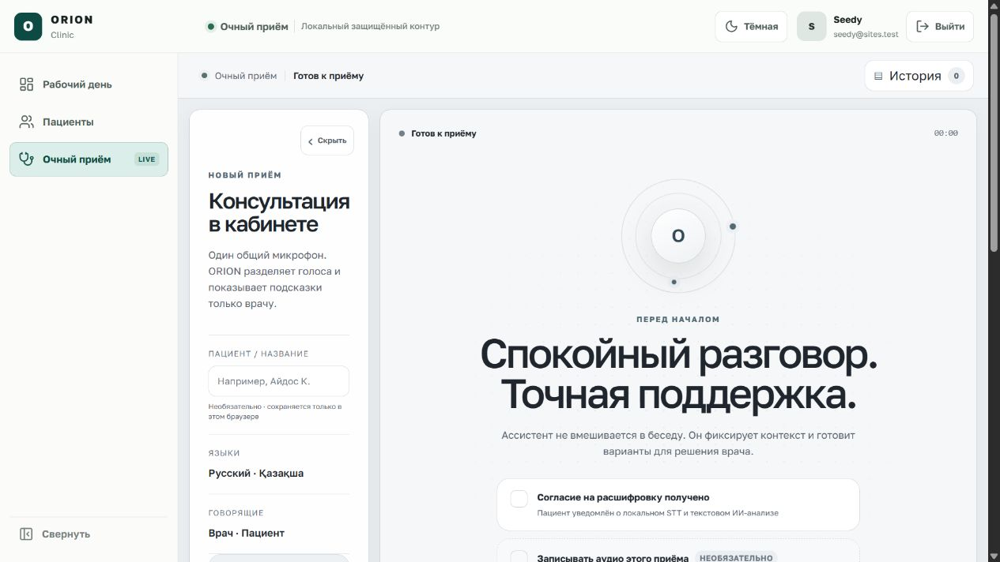

> **Важно.** Текущий checkpoint работает только с синтетическими данными.
> Микрофон и локальный GigaAM STT подключены как прототипный контур без хранения
> сырого аудио. Groq создаёт только черновики и работает лишь после отдельного
> согласия, проверки расшифровки врачом и настройки нового API-ключа. Это не
> клинически валидированный production-контур. Не вводите сведения реального
> пациента.

## 1. Вход и безопасное открытие записи

1. Откройте ORION Clinic и войдите через поддерживаемую Sites-сессию.
2. Сервер проверит активного пользователя, членство в клинике, роль врача и
   точное назначение выбранного приёма.
3. Рабочая область появится только после записи append-only события доступа.
4. Метка **«Просмотр зафиксирован»** означает, что сервер подготовил
   авторизованный ответ и связал событие с врачом, клиникой, приёмом и server-side
   request ID. Она не является доказательством, что человек прочитал весь экран.

Для выхода нажмите кнопку со стрелкой **«Выйти»** справа в верхней панели. Ссылка
открывает системный маршрут `/signout-with-chatgpt` во всём окне, очищает только
Sites-сессию ORION Clinic и возвращает на экран входа. На узком экране подпись
скрывается, но иконка выхода остаётся доступной.

Если аудит доступа недоступен, клинический ответ не выдаётся. До определения
безопасного tenant/facility scope запросы 401/403/404 остаются только в
PHI-minimized техническом журнале: в нём нет URL query, имени, MRN, расшифровки,
email или внешнего identity subject.

## 2. Обзор рабочего места

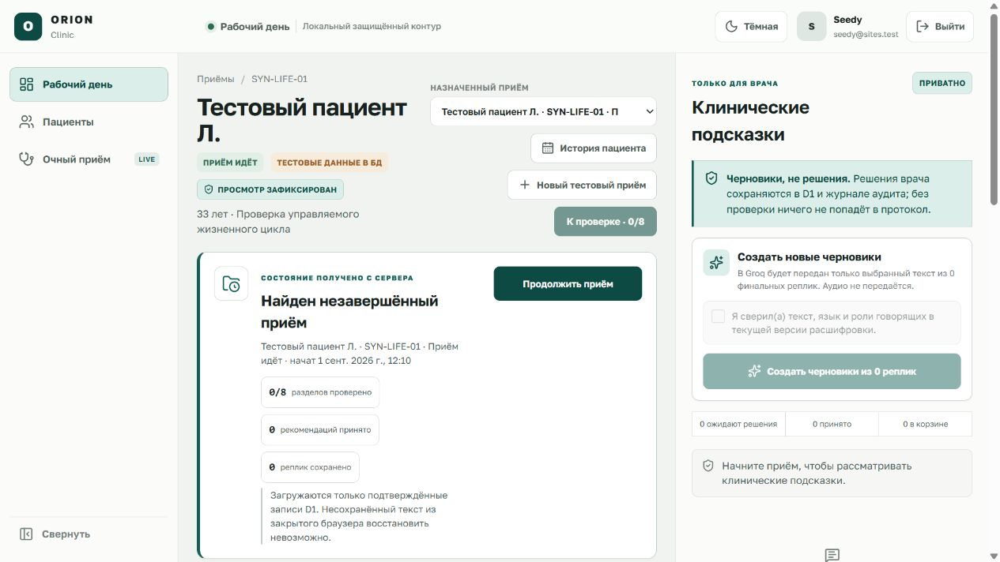

На общем экране:

1. Верхняя панель показывает текущий раздел, локальный защищённый контур,
   фактического пользователя Sites, тему и выход.
2. Левая навигация открывает работающие разделы: рабочий день, реестр пациентов,
   очный приём, направления/результаты, локальные запись/очередь и
   **«Наблюдение»**. Последний раздел использует подписанный врачом план и
   ролевые списки задач; его отдельная инструкция находится в
   [`chronic-care.ru.md`](chronic-care.ru.md).
3. Заголовок содержит синтетического пациента, статус приёма, назначенный
   encounter и подтверждение аудита чтения.
4. Центральная колонка содержит документы, решения пациента, расшифровку и
   восемь разделов клинической записи.
5. Правая колонка предназначена только для врача. Рекомендации являются
   черновиками; решение принимает врач.

Одна и та же оболочка, шрифт, активная навигация, тема, пользователь и выход
сохраняются на главном дэшборде, в реестре/карточке пациента и в модуле очного
приёма. Содержимое страниц различается по задаче, но это больше не три отдельных
визуальных приложения.

Навигация зависит от активной роли D1: врач видит все три текущих раздела,
регистратор — только реестр пациентов. Совместимые STT и AI-маршруты `/live`
дополнительно проверяют активную роль врача на сервере; одного факта входа в Sites
недостаточно.

При переходе с карточки пациента или рабочего дня `/live` получает точный
`encounterId`. Экран заново загружает пациента, статус, согласия, расшифровку и
подсказки из D1. Если идентификатор не передан, сервер выбирает только доступный
текущему врачу encounter и добавляет его в URL. Чужой, завершённый или более не
назначенный приём не заменяется демонстрационной записью: клинические действия
остаются заблокированными.

## 3. Реестр и карточка пациента

Откройте **«Пациенты»** в левой навигации. Реестр загружает карточки из D1 только
в пределах текущей организации и филиала. Поиск работает по ФИО, номеру карты,
тестовому ИИН и телефону. Пустая выборка отображается как пустое состояние, а не
как заранее подготовленный список. Если пользователю доступны несколько филиалов,
сначала появляется явный выбор; выбранный `facilityId` сохраняется во всех ссылках
на карточку, фотографию и создание приёма.

Над списком доступны три фильтра состояния:

- **«Активные»** — текущий рабочий список; этот фильтр выбран по умолчанию;
- **«Архив»** — только выведенные из активной работы карточки;
- **«Все»** — активные и архивные карточки вместе.

Поиск применяется внутри выбранного фильтра. Поэтому отсутствие пациента в
**«Активных»** не означает удаление: перед повторным созданием проверьте
**«Архив»** и **«Все»**.

Перед выдачей списка, карточки или фотографии сервер добавляет PHI-minimized
событие `patient.*` в хеш-цепочку аудита филиала. Если аудит не сохранился, ответ с
данными пациента не возвращается.

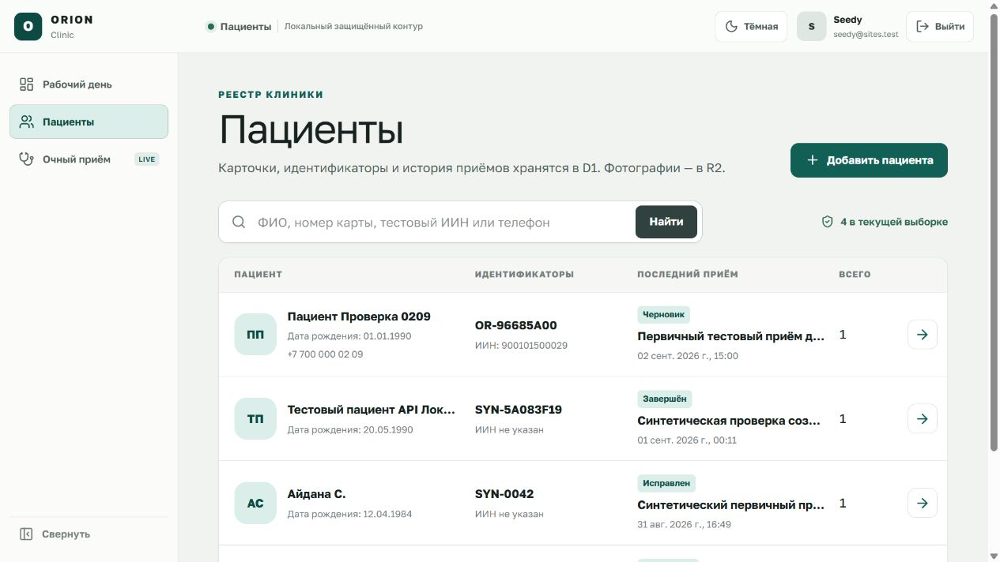

Чтобы создать карточку:

1. Нажмите **«Добавить пациента»**.
2. Введите только вымышленные ФИО, тестовый ИИН, дату рождения и контактные
   данные. Номер медицинской карты создаёт сервер.
3. При необходимости выберите JPEG, PNG или WebP до 4 МБ. Сервер сверяет тип с
   фактической сигнатурой изображения. Байты фотографии сохраняются в R2, а версия
   и контрольная сумма — в D1.
4. Подтвердите, что данные вымышленные, и нажмите **«Создать карточку»**.
5. Перезагрузка страницы не должна удалять карточку: профиль, идентификатор и
   контакты являются серверными записями, а не состоянием браузера.

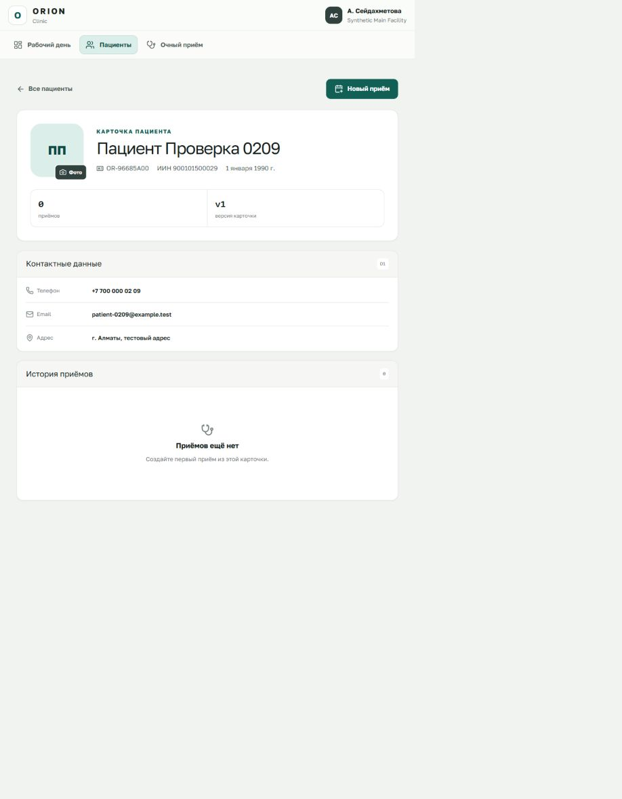

### Изменение профиля без перезаписи истории

Изменять можно только активную синтетическую карточку:

1. Откройте карточку и нажмите **«Редактировать»**.
2. Сверьте пациента по ФИО, номеру карты и тестовому ИИН. ИИН показан только для
   чтения: этот идентификатор нельзя заменить через форму редактирования.
3. Исправьте необходимые демографические или контактные данные.
4. Укажите обязательную причину изменения и подтвердите, что данные остаются
   полностью вымышленными.
5. Нажмите **«Сохранить новую версию»**. Сервер проверит номер текущей версии,
   создаст следующую неизменяемую версию профиля и добавит её в
   **«Историю карточки»**. Предыдущие значения не переписываются и не исчезают.

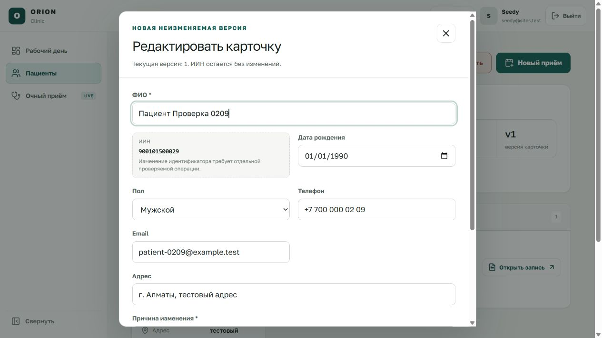

Если одна карточка открыта в двух вкладках, первая сохранённая вкладка меняет
серверную версию. Попытка сохранить устаревшую форму во второй вкладке не
перезапишет новые данные: появится сообщение о конфликте. Введённые во второй
вкладке значения остаются в форме для сверки. Нажмите **«Загрузить серверную
версию»** только после их проверки — форма будет заменена последним состоянием
из D1, после чего нужные изменения следует внести повторно уже поверх актуальной
версии.

### Архивирование без физического удаления

Архивирование предназначено для вывода карточки из активного рабочего списка, а
не для уничтожения медицинской истории:

1. В активной карточке нажмите **«Архивировать»**.
2. Прочитайте предупреждение, укажите обязательную причину и подтвердите работу
   только с вымышленными данными.
3. Подтвердите архивирование. Сервер создаст ещё одну неизменяемую версию со
   статусом **«В архиве»**; сама карточка, прежние версии, приёмы и документы не
   удаляются.
4. Откройте в реестре фильтр **«Архив»** и убедитесь, что карточка доступна для
   просмотра вместе с полной **«Историей карточки»**.

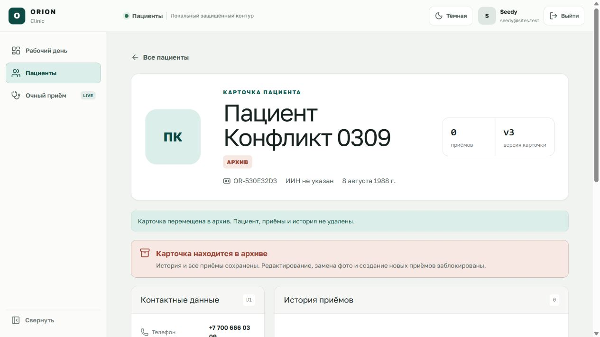

Архив является конечным состоянием в текущем локальном checkpoint. Для архивной
карточки интерфейс больше не предлагает редактирование, загрузку новой фотографии
или создание приёма; сервер также отклоняет такие запросы. Физическое удаление,
восстановление из архива и объединение дублей в этом checkpoint не реализованы.
Все описанные действия относятся только к локальным синтетическим данным и не
подтверждают готовность к работе с реальными пациентами.

Из карточки нажмите **«Новый приём»**, укажите причину обращения и выберите
**«Создать и открыть»**. ORION создаст отдельный encounter в статусе
**«Черновик»**, назначит его текущему врачу, добавит восемь пустых разделов и
откроет основной дэшборд по точному `encounterId`. Никакой клинический текст,
согласие или решение не заполняется автоматически.

## 4. Выбор и создание синтетического приёма

В списке **«Назначенный приём»** отображаются только приёмы, назначенные текущему
врачу. При выборе другого encounter клиент отправляет его точный идентификатор в
API-запросе, а сервер повторно проверяет доступ и записывает новое событие чтения.

Чтобы создать тестовую карточку:

1. Нажмите **«Новый тестовый приём»**.
2. Введите только вымышленное имя, дату рождения, пол и вымышленную причину
   обращения.
3. Установите флажок **«Подтверждаю: данные полностью вымышлены»**.
4. Нажмите **«Создать черновик»**. Система создаст test MRN и назначит приём
   текущему врачу; согласия останутся незаполненными.

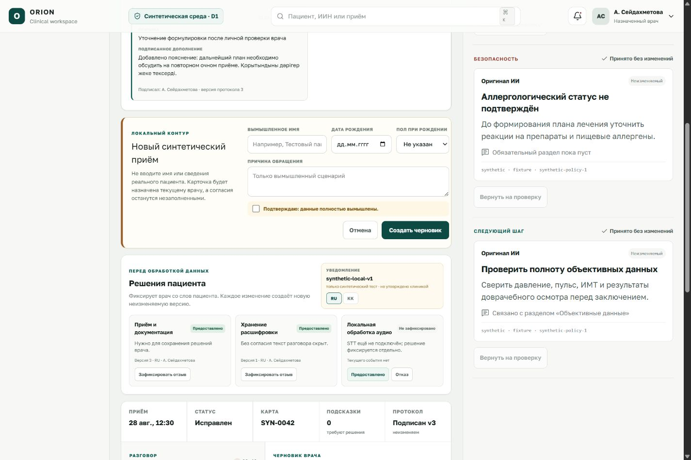

## 5. Возобновление незавершённого приёма

Для статусов **«Приём идёт»** и **«Проверка»** сервер возвращает отдельный
recovery snapshot. Панель показывает точного пациента и encounter, статус,
время начала и только подтверждённые сервером счётчики.

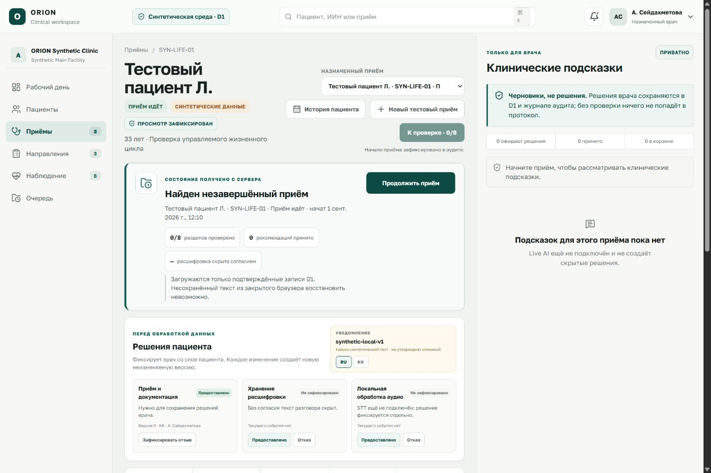

Нажмите **«Продолжить приём»** или **«Продолжить проверку»**. Перед разблокировкой
клинических действий приложение заново получает точное состояние D1. Оно
восстанавливает подтверждённые записи, но не может восстановить несохранённый
текст из закрытой вкладки браузера.

Если серверное состояние не удалось повторно подтвердить, действия врача
блокируются. Не вводите данные повторно вслепую: восстановите соединение и
нажмите кнопку проверки ещё раз.

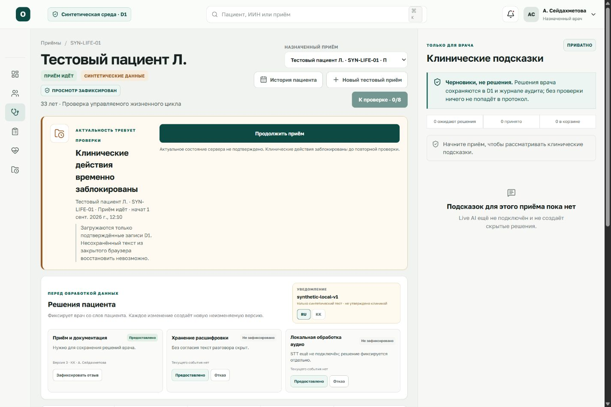

## 6. Решения пациента и согласия

Раздел **«Решения пациента»** хранит отдельные неизменяемые версии для:

- приёма и документации;
- хранения расшифровки;
- локальной обработки аудио;
- необязательного сохранения локального аудиофайла;
- передачи подтверждённой расшифровки в Groq для создания черновиков.

Врач выбирает RU/KK версию уведомления и фиксирует **«Предоставлено»**,
**«Отказ»** или последующий отзыв. Без действующего согласия на хранение
расшифровки сервер не возвращает текст разговора. Согласие на локальную обработку
аудио не означает согласие на Groq: это два независимых решения. Отзыв любого из
трёх согласий, необходимых для речи, немедленно блокирует или останавливает новую
речевую сессию. На экране **«Очный приём»** эти три условия больше не выглядят как
неработающий общий чекбокс: каждое решение показывает собственный статус и версию.
Если ранее был отказ или отзыв, врач может после нового ответа пациента нажать
**«Зафиксировать предоставление»**. Ссылка **«Все согласия и история отзывов»**
возвращает к полной карточке решений.

## 7. Расшифровка и роли говорящих

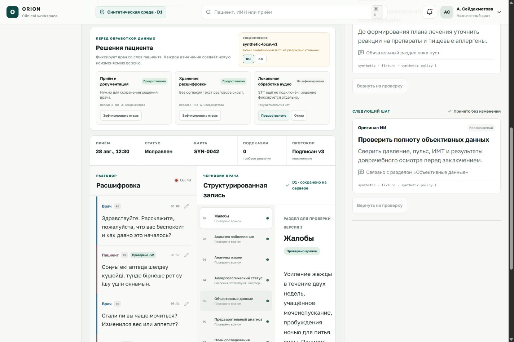

Каждая реплика показывает:

- роль **«Врач»** или **«Пациент»** не только цветом, но и текстом;
- язык RU, KK или MIXED;
- временную отметку;
- версию ручной коррекции, если она есть.

Для неподписанного приёма кнопка с карандашом открывает ручное исправление текста,
роли и языка. Сохранение создаёт новую append-only версию сегмента; исходная
реплика не переписывается. После подписания протокола исправление реплик
заблокировано.

### Живая локальная расшифровка

1. Убедитесь, что открыт правильный синтетический encounter в статусе
   **«Приём идёт»**, нажмите **«Продолжить приём»** и дождитесь подтверждения D1.
2. В блоке **«Решения пациента перед записью»** выберите язык уведомления и
   отдельно зафиксируйте действующие решения для приёма, хранения расшифровки и
   локальной обработки аудио. Кнопка запуска покажет точное недостающее условие.
3. При необходимости отдельно нажмите **«Включить с согласия пациента»** для
   локального аудиофайла. Без этого STT работает, но аудиофайл не создаётся.
4. Нажмите **«Начать расшифровку»** и самостоятельно разрешите доступ к микрофону
   в браузере. ORION не выдаёт такое разрешение автоматически.
5. Говорите по очереди. Клиент калибрует уровень шума, держит короткий pre-roll,
   завершает реплику после паузы и последовательно отправляет короткие WAV 16 кГц
   mono на локальный контур. Сырое аудио не сохраняется в D1/R2.
6. Каждая финальная реплика получает видимую роль, язык и метку
   **«STT · требует проверки»**. Врач может исправить роль/язык/текст, после чего
   отображается **«Исправлено врачом · vN»**.
7. Нажмите **«Остановить расшифровку»** до смены пациента или перехода к проверке.
   Активная реплика сначала финализируется, затем речевая сессия закрывается.

В модуле **«Очный приём · LIVE»** используется тот же точный D1 encounter, что и
на главном дэшборде. Реплика появляется только после ответа серверного speech API;
коррекция роли связывается с существующим append-only сегментом. Поле названия,
история в этом браузере и необязательная локальная аудиозапись помогают организовать
работу на одном компьютере, но не заменяют серверную карточку или подписанный
комплект документов.

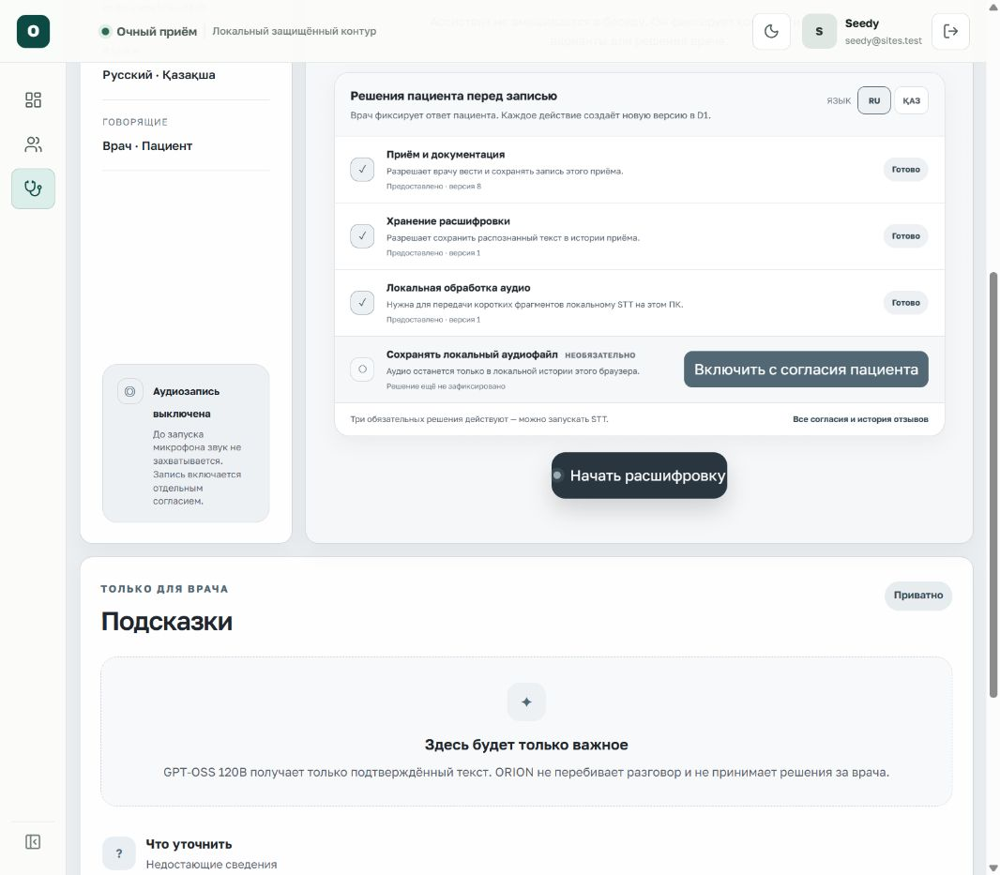

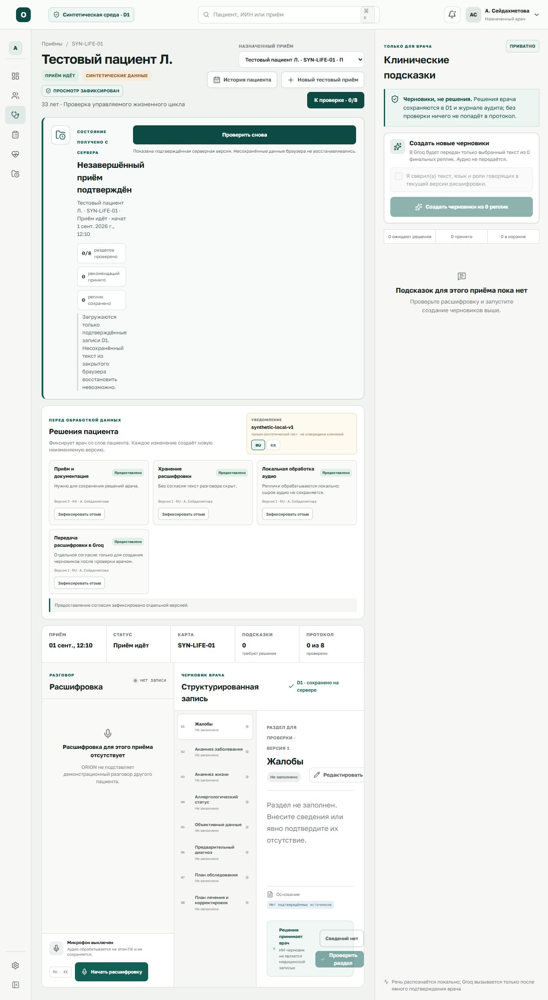

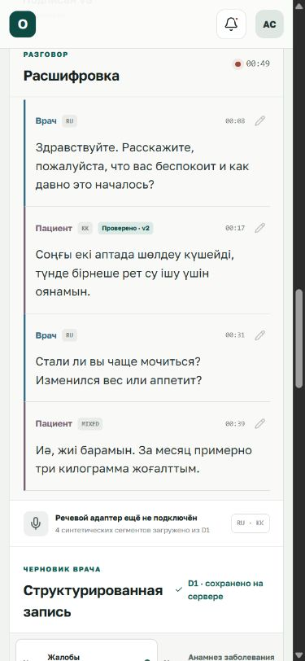

## 8. Восемь разделов клинической записи

Навигация **«Разделы протокола»** содержит:

1. Жалобы.
2. Анамнез заболевания.
3. Анамнез жизни.
4. Аллергологический статус.
5. Объективные данные.
6. Предварительный диагноз.
7. План обследования.
8. План лечения и корректировок.

Верхняя памятка **«Что нужно сделать врачу»** объясняет назначение блока и
показывает прогресс `N/8`. Врач открывает раздел, сверяет текст и основание, затем выбирает
**«Проверить раздел»** либо явно подтверждает **«Сведений нет»**. Подписание
возможно только после человеческого решения по всем обязательным разделам.
Источники вроде `seg-002` позволяют проследить, из каких синтетических сегментов
получено утверждение. Если раздел пуст, **«Проверить раздел»** намеренно
недоступна: сначала нажмите **«Редактировать»** и сохраните текст либо выберите
**«Сведений нет»**.

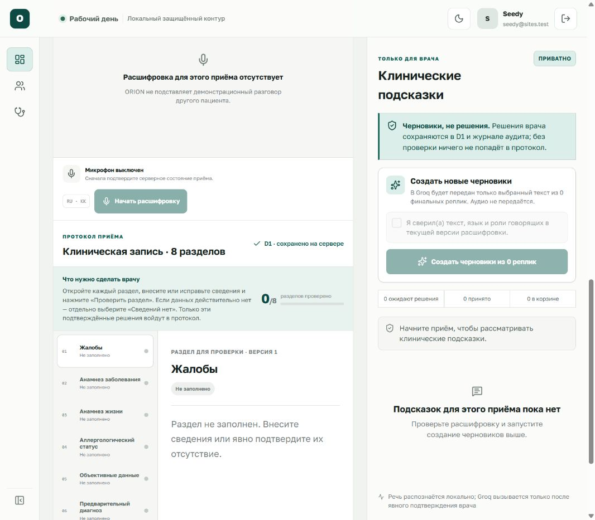

## 9. Клинические подсказки и Groq

Правая колонка отделяет три сущности:

- **Оригинал ИИ** — неизменяемый синтетический источник;
- **Версия врача** — отдельная производная версия с автором и основанием;
- **Решение** — принять точную версию, отправить в корзину или восстановить.

Отклонённая подсказка не удаляется: она остаётся в истории и корзине, но не
попадает в протокол. После подписания решения блокируются; изменения оформляются
как подписанная корректировка.

Новые черновики создаются только вручную:

1. остановите запись и проверьте, что нет предварительных реплик;
2. исправьте роль, язык или текст там, где это нужно;
3. зафиксируйте отдельное согласие **«Передача расшифровки в Groq»**;
4. отметьте подтверждение точной текущей версии расшифровки;
5. нажмите **«Создать черновики из N реплик»**.

На `/live` это подтверждение объединено в одну явную проверку текста, языков и
ролей говорящих. Автоматического запуска по таймеру в D1-режиме нет. Команда
передаёт серверу точные `{id, version}` текущих реплик; устаревшая версия или
изменившееся согласие приводят к отказу и повторной загрузке, а не к анализу
другого текста.

Сервер отправляет только точный final/corrected snapshot и хранит durable run до
внешнего вызова. Ответ проверяется по JSON Schema, цитаты должны дословно
совпадать с исходными сегментами, а лекарственные дозировки и императивные
назначения отбрасываются. Результат появляется только в состоянии **pending**;
врач принимает, редактирует или отправляет его в корзину. Ошибка Groq не удаляет
расшифровку и не блокирует ручную работу.

## 10. Протокол, документы и корректировки

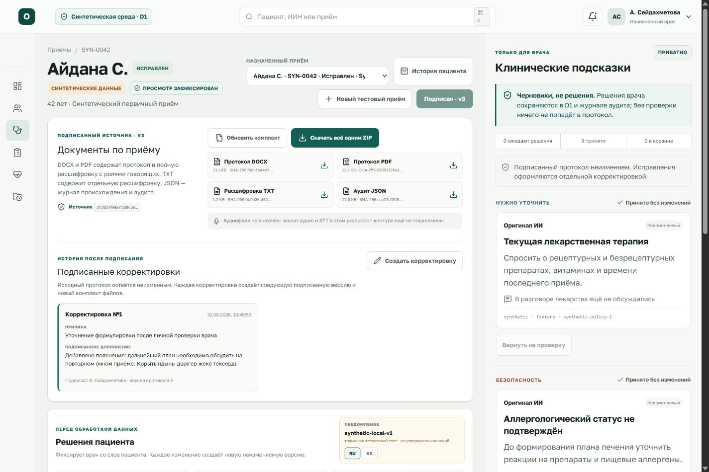

После человеческой проверки восьми разделов врач:

1. создаёт черновик протокола из точных подтверждённых версий;
2. лично подтверждает и подписывает точную версию, после чего она становится
   неизменяемой;
3. формирует комплект документов;
4. скачивает отдельный файл или **«Скачать всё одним ZIP»**.

Комплект включает:

- DOCX и PDF с клиническим протоколом и полной подписанной расшифровкой;
- отдельный transcript TXT;
- audit/provenance JSON;
- ZIP с manifest и SHA-256 всех файлов.

Успешная выдача каждого файла фиксируется в отдельной access-audit цепочке до
отправки байтов. Событие не содержит имя пациента, MRN, filename, object key,
текст протокола или расшифровку. Если D1/R2 объект, размер, SHA-256 или аудит не
подтверждены, файл не выдаётся.

Подписанный протокол не перезаписывается. **«Создать корректировку»** формирует
следующую подписанную версию с причиной и дополнением, сохраняя predecessor chain.

## 11. Запись к специалисту и электронная очередь

Раздел **«Запись и очередь»** использует действующее подтверждённое направление
из D1. Врач или регистратор фиксирует пожелания пациента, удерживает только
существующий локальный тестовый слот и получает отдельное подтверждение пациента.
После подтверждения запись можно связать с электронным талоном и провести через
детерминированные состояния очереди. AI не создаёт свободные окна и не меняет их
статус.

Текущий источник всегда подписан **«Тестовое ручное расписание · не КМИС»**.
Пошаговая инструкция, правила отмены, ручной проверки и известные ограничения
приведены в [`scheduling-queue.ru.md`](scheduling-queue.ru.md).

## 12. Компактная навигация и мобильный режим

Кнопка **«Свернуть»** внизу левой панели освобождает место, сохраняя иконки и
доступные названия элементов.

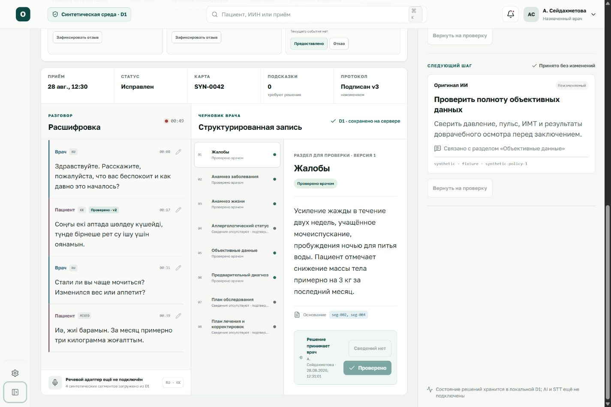

На мобильном экране заголовок, выбор encounter, действия и документы переходят в
одну последовательную колонку. Основная запись идёт раньше приватных подсказок.

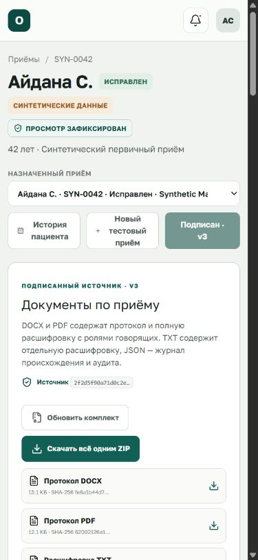

## 13. Что делать при ошибке

| Состояние | Значение | Действие врача |
| --- | --- | --- |
| Требуется вход | Нет поддерживаемой Sites-сессии | Выполнить вход и повторить |
| Нет доступа | Нет активной роли/назначения | Проверить членство и назначение у администратора |
| Приём не найден или недоступен | Нейтральный 404, существование чужого приёма не раскрывается | Вернуться к назначенным приёмам |
| Состояние изменилось | Сервер обнаружил конкурентное изменение | Повторно загрузить точный encounter; не перезаписывать локальный текст |
| Не удалось зафиксировать доступ | Access-audit не подтверждён | Данные не открыты; повторить после восстановления D1 |
| Локальная модель загружается | GigaAM ещё не готов после холодного запуска | Подождать завершения загрузки и повторить запуск; проверить `http://127.0.0.1:3101/health` |
| Речевой сервис недоступен | Процесс STT на 3101 не запущен или завершился | Запустить `START_ORION.bat`, проверить `.orion-runtime/logs/speech.err.log` |
| Groq не настроен | В `.dev.vars` нет нового `GROQ_API_KEY` | Запустить `CONFIGURE_GROQ.bat`, затем перезапустить ORION; ключ в браузер не вводить |
| Анализ временно недоступен | Внешний запрос не выполнен или ответ не прошёл проверку | Сохранить ручную работу, проверить журнал и повторить только по подтверждённой версии текста |
| Файл не готов или не прошёл проверку | Нет ready-артефакта, R2-объекта или совпадающего SHA-256 | Сформировать комплект повторно; файл не считать выданным |
| Резерв времени истёк или изменился | Истекли 15 минут либо другой запрос уже продвинул версию | Обновить расписание; не создавать вторую запись вслепую |

## 14. Краткая памятка врача

Перед завершением синтетического сценария проверьте:

- открыт правильный пациент и exact encounter;
- видна метка **«Просмотр зафиксирован»**;
- решения пациента зафиксированы нужной RU/KK версией;
- роли и язык каждой важной реплики подтверждены;
- все восемь разделов проверены или явно отмечены как отсутствующие;
- в протокол попали только точные принятые версии подсказок;
- подписанная версия и SHA источника соответствуют экрану;
- необходимые DOCX/PDF/TXT/JSON/ZIP скачаны;
- исправления после подписания созданы только через корректировку.

## 15. Ограничения checkpoint

Локально проверены Sites identity, D1 authorization, exact encounter scope,
append-only клинические команды, отдельная access-audit цепочка, документы,
desktop/mobile интерфейс, GigaAM/CAMPPlus speech API и синтетическое восстановление
D1/R2. Браузерный микрофон не включался автоматически при проверке: доступ должен
выдать сам пользователь. Реальный вызов Groq требует нового локального секрета и
не заявляется проверенным без него. Не подключены и не заявляются как готовые:
production OIDC/MFA, реальные пациенты, клинически утверждённые согласия,
production STT/AI operations, юридически значимая электронная подпись,
реальное расписание/запись КМИС, автоматические уведомления, доверенный cleanup
просроченных резервов, KMIS/ERDB/PUZ/ECG, production hosting, retention и disaster
recovery.
