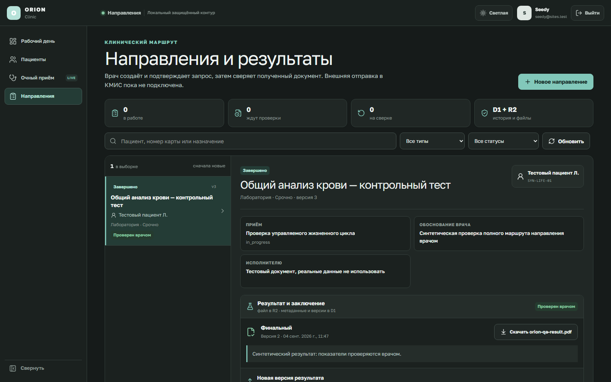

# ORION Clinic — направления и результаты

Этот документ описывает локальный синтетический контур Phase 4. Экран находится
по адресу `http://localhost:3200/orders` и доступен из общей навигации
**«Направления»**. Он работает с D1 и R2, но пока не отправляет данные в КМИС,
лабораторию, ЭКГ-систему или расписание специалиста.



## Что хранится

- D1 хранит направление, текущую версию, неизменяемую историю статусов,
  врачебное обоснование, решение врача, метаданные результата и журнал аудита.
- R2 хранит только байты прикреплённого PDF, JPEG или PNG.
- Для каждого файла сохраняются размер, тип и SHA-256. При скачивании размер и
  хэш проверяются повторно до выдачи файла.
- До записи байтов создаётся долговечное намерение загрузки в D1. Поэтому обрыв
  между D1 и R2 не превращает файл в неизвестный объект: точный повтор продолжает
  ту же команду, а просроченная незавершённая загрузка проходит аудируемую
  двухэтапную сверку и только затем удаляется из R2.
- Все данные локального checkpoint должны быть искусственными. В форме требуется
  отдельное подтверждение, что реальные данные не используются.

## Рабочий путь врача

1. Нажмите **«Новое направление»**.
2. Выберите один из доступных врачу приёмов. Приём без действующего согласия
   отображается, но выбрать его нельзя.
3. Выберите тип: лаборатория, ЭКГ, услуга или консультация специалиста. Для
   консультации обязательно указывается специальность.
4. Заполните требуемое исследование/услугу, медицинское обоснование и при
   необходимости примечание исполнителю. Сохранение создаёт только черновик.
5. Введите причину решения и нажмите **«Подтвердить»**. Это отдельная врачебная
   команда; ИИ не подтверждает и не отправляет направление.
6. Когда результат получен вне ORION, прикрепите PDF/JPEG/PNG размером до 10 МБ,
   укажите статус документа, заключение и причину появления версии.
7. Сверьте документ и выберите **«Проверено врачом»** либо
   **«Нужна сверка»**. При расхождении комментарий обязателен, а следующая
   исправленная версия не затирает предыдущую.
8. Завершение доступно только для результата со статусом `final`, `amended` или
   `corrected`, который явно проверен врачом.

## Смысл статусов

### Направление

- **Черновик** — сохранено врачом, но ещё не подтверждено.
- **Подтверждено** — активный локальный запрос; это не доказательство отправки
  во внешнюю систему.
- **Приостановлено** — ожидается ручное уточнение.
- **Завершено** — доверенный результат приложен и проверен врачом.
- **Отозвано** — направление отменено с сохранением истории.
- **Ошибочно** — запись помечена как введённая по ошибке; физического удаления нет.

### Результат

- `registered` / `preliminary` — документ зарегистрирован или предварительный;
  завершить направление нельзя.
- `final` — финальный документ.
- `amended` — дополнение к ранее полученному результату.
- `corrected` — исправленная версия результата.
- **Ожидает проверки** — решение врача ещё не записано.
- **Проверен врачом** — врач сверил конкретную версию.
- **Нужна сверка** — обнаружено расхождение; требуется новая версия или ручное
  выяснение источника.

## Защита от дублей и конфликтов

Каждая команда имеет idempotency key и ожидаемую версию. Повтор того же запроса
возвращает точный снимок, сохранённый в момент команды, а изменённая команда с использованным ключом или
устаревшей версией отклоняется. Триггеры SQLite/D1 запрещают обновлять или
удалять версии и требуют линейного продвижения current head. При проверке врача
следующая версия обязана сохранить тот же файл, заключение и статус результата;
изменение медицинского содержимого требует отдельной новой версии и новой проверки.

## Что пока намеренно отсутствует

- реальная передача, acknowledgement и retry в КМИС/LIS/ЭКГ;
- реальное расписание и автоматическая запись к специалисту;
- импорт структурированных лабораторных показателей;
- обработка сырой ЭКГ-волны и клиническая интерпретация алгоритмом;
- production OIDC/MFA, реальные пациентские данные и юридически значимая
  электронная подпись.

До подключения внешнего адаптера клиника должна определить source of truth,
форматы, владельца статусов, sandbox, права записи, legal basis и правила ручной
сверки. Модель жизненного цикла ориентируется на нейтральные понятия
[FHIR R4 ServiceRequest](https://hl7.org/fhir/R4/servicerequest.html) и
[FHIR R4 DiagnosticReport](https://hl7.org/fhir/R4/diagnosticreport.html), но
текущий формат ORION не заявлен как готовый FHIR-интерфейс.

## Проверка разработчиком

```powershell
cd "C:\Users\profm\OneDrive\Документы\ChatGPT\ORION-CLINIC"
.\START_ORION.bat
pnpm verify
pnpm backup:drill:local
```

Проверка страницы не заменяет проверку базы, авторизации и восстановления.
`pnpm verify:ci` дополнительно запускает сетевой dependency audit; при
недоступности npm registry он корректно завершается ошибкой, а не считается
успешным.
