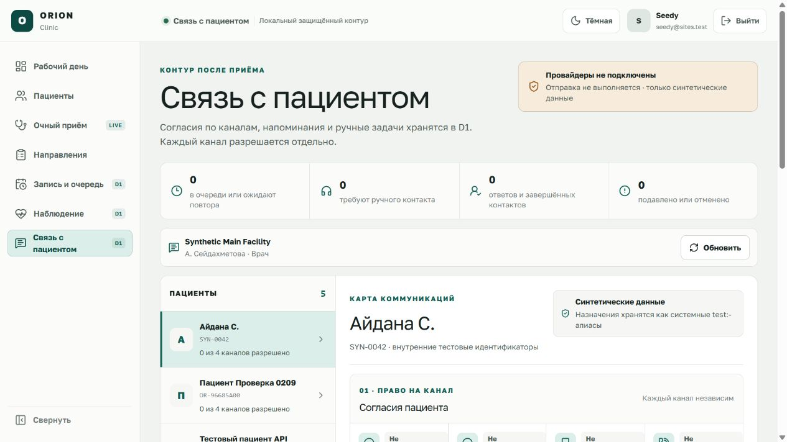
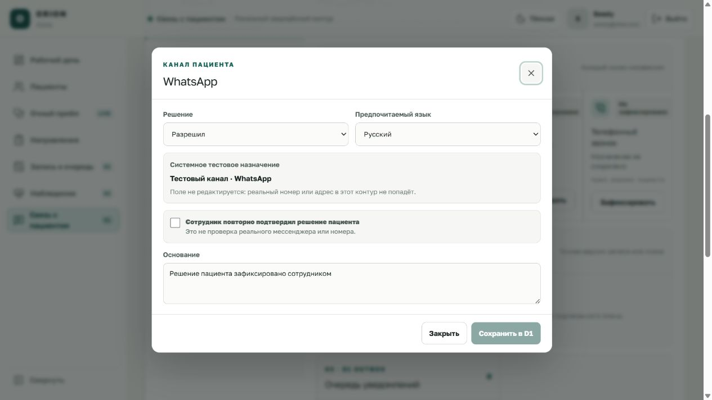
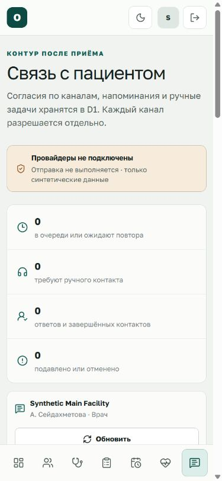

# ORION Clinic — связь с пациентом

Раздел `/communications` — локальный синтетический срез Phase 7. Он хранит
решения пациента по каналам, создаёт проверяемые намерения напоминаний и даёт
сотруднику ручную задачу после наступления срока, если автоматический канал
недоступен и контакт не запрещён тихими часами.

> Провайдеры WhatsApp, Telegram, SMS и телефонии не подключены. Экран не
> отправляет сообщения, не звонит пациенту и не показывает фиктивный статус
> «доставлено». Не вводите реальные номера, аккаунты или сведения пациентов.

## 1. Кто и что может делать

- врач видит только пациентов, для которых у него есть текущее допустимое
  основание: назначенный приём/встреча либо управляемый им действующий контур
  наблюдения; фиксирует решение по каналу, ставит напоминание в очередь,
  проверяет отключённый адаптер, отменяет намерение и ведёт доступный ему ручной
  контакт;
- регистратор работает только с пациентами и напоминаниями, связанными с
  доступной ему текущей записью;
- медсестра видит только пациента и ручное продолжение по назначенной ей
  действующей задаче подписанного плана, фиксирует ответ пациента и передаёт
  ситуацию ответственному врачу;
- каждый API-запрос повторно проверяет Sites identity, активное членство,
  организацию, филиал, роль и доступ к точному источнику.

Список пациентов тоже формируется по доступным текущим источникам, а не по всему
филиалу. Показанные браузером кнопки не заменяют серверную проверку. Другая роль,
филиал, пациент, версия или источник отклоняются без раскрытия чужих данных.

## 2. Подготовка искусственных данных

Обычный `START_ORION.bat` применяет миграции, но не добавляет пациентов и
клинические fixtures. Для полного локального сценария выполните:

```powershell
cd "C:\Users\profm\OneDrive\Документы\ChatGPT\ORION-CLINIC"
pnpm db:seed:local
pnpm db:seed:scheduling:local
pnpm db:seed:care:local
pnpm db:seed:communications:local
```

Последняя команда допускает повторный запуск. Она добавляет одну локальную
политику тихих часов 21:00–08:00 и 16 шаблонов со статусом `approved_test`:
напоминание о записи и действие подписанного плана для четырёх каналов на русском
и казахском. Шаблоны версионируются. При создании намерения сервер выбирает
последнюю подходящую утверждённую тестовую версию и сохраняет ссылку именно на
неё; старая версия остаётся неизменяемой. Реальные адреса, ключи и delivery
receipts не создаются.

## 3. Отдельное решение по каждому каналу

1. Откройте **«Связь с пациентом»** в общей навигации.
2. Выберите искусственную карточку пациента.
3. В блоке **«Согласия пациента»** нажмите **«Зафиксировать»** у нужного канала.
4. Выберите `Разрешил`, `Отказал` или, для ранее разрешённого канала, `Отозвал`;
   отдельно задайте русский или казахский язык.
5. Для разрешения подтвердите проверку тестового назначения. Назначение выбирается
   только из фиксированных синтетических системных алиасов. Поля для свободного
   ввода реального телефона, WhatsApp/Telegram-аккаунта или другого адреса нет.
   Укажите основание со слов пациента.
6. Нажмите **«Сохранить в D1»**. Создаётся новая неизменяемая версия; прежние
   события остаются в истории.

Отзыв или отказ немедленно блокирует новую попытку по этому каналу. Он не удаляет
события, которые нужны для аудита. Решение по SMS не разрешает WhatsApp, звонок
или Telegram.

## 4. Основание и постановка в очередь

Допустимые источники ограничены текущими серверными данными:

- точной версией подтверждённой записи;
- незавершённой задачей из точной подписанной версии плана наблюдения.

Чтобы создать намерение:

1. убедитесь, что по выбранному каналу действует разрешение пациента;
2. нажмите **«Поставить в очередь»** у источника;
3. проверьте канал, язык, время и основание;
4. нажмите **«Сохранить намерение»**.

Сервер повторно проверяет пациента, филиал, роль, текущее согласие, версию
источника, назначение, локальную политику и точную версию шаблона. Сообщение
сохраняется как предпросмотр минимального содержания, а не как доказательство
отправки.

## 5. Состояния очереди

| Состояние на экране | Что доказано | Следующее действие |
| --- | --- | --- |
| Запланировано | Намерение и точные версии основания/согласия/шаблона сохранены | Дождаться срока; до него ручной контакт недоступен |
| Отложено до конца тихих часов | Политика запрещает попытку сейчас | Дождаться разрешённого окна |
| Ожидает повтора | Отключённый адаптер уже дал фиксированный сбой | Повторить в пределах лимита или передать вручную |
| Провайдер недоступен | Зарезервированное состояние будущего provider adapter | На текущем экране нет ручной команды, которая выставляет этот статус |
| Нужен ручной контакт | Создана задача конкретному сотруднику | Связаться вне ORION и записать результат |
| Ответ пациента записан | Сотрудник сохранил слова пациента и источник | Врач отдельно принимает клиническое решение |
| Ручной контакт завершён | Исполнитель завершил задачу с основанием | Событие остаётся в аудите |
| Подавлено после отзыва | Текущее согласие больше не разрешает канал | Не отправлять; получить новое решение отдельно |
| Источник больше не актуален | Запись/задача перестала быть текущим основанием | Создать новое намерение только из нового источника |
| Отменено сотрудником | Авторизованный сотрудник явно отменил намерение | Причина и версия остаются в истории |

Статусы `Провайдер недоступен` и терминальный `Доставлено` предусмотрены доменным
контрактом для будущего подтверждённого provider adapter. Локальный отключённый
адаптер не предлагает отдельную UI-команду `provider_unavailable` и никогда не
выставляет `Доставлено`.

## 6. Ручной fallback и ответ пациента

После исчерпания допустимых повторов или разрешённого действия
**«Передать вручную»** появляется задача сотрудника. Это действие доступно только
после наступления срока напоминания. Если действует политика тихих часов,
обработка откладывается до разрешённого окна и ручной контакт не открывается
раньше. Перед началом контакта сервер повторно проверяет текущее согласие и
актуальность точного источника. Исполнитель может начать работу, записать тип и
краткое содержание ответа пациента, завершить, отменить или эскалировать задачу
в пределах своей роли.

Ответ — это только датированная запись со слов пациента. Он не меняет диагноз,
лекарство, подписанный план, запись или очередь автоматически. Клиническое и
транзакционное решение принимает соответствующий сотрудник в основном модуле.

## 7. Повторы, конфликты и неизвестный результат

Каждая команда содержит ожидаемую версию и idempotency key. Точный повтор
возвращает прежний результат; другое содержимое с тем же ключом и устаревшая
версия отклоняются.

| Сообщение | Значение | Действие сотрудника |
| --- | --- | --- |
| Состояние изменилось | Другая сессия уже записала новую версию | Обновить экран и проверить текущий статус |
| Канал или источник недоступен | Нет разрешения, роли, назначения или текущей версии | Не подбирать ID вручную; проверить карточку и основание |
| Результат команды неизвестен | Связь оборвалась после запроса, сервер мог сохранить действие | Сначала обновить; при необходимости повторить с тем же сохранённым ключом |
| Провайдер не настроен | Внешнего сообщения и delivery receipt нет | После срока и вне тихих часов использовать контролируемый ручной fallback |

## 8. Что остаётся внешним gate

До утверждения клиникой и технической проверки не реализованы и не заявляются
готовыми:

- реальные WhatsApp Business, Telegram, SMS и telephony adapters;
- production-тексты согласий, владельцы бизнес-аккаунтов и медицински
  утверждённые шаблоны;
- защищённая ссылка, правила минимального содержания и её авторизация;
- доверенный background worker/cron, SLA, reconciliation и мониторинг;
- автоматическая интерпретация свободного текста ответа пациента;
- production identity, реальные данные, сроки хранения и эксплуатационная
  валидация.

Текущий экран доказывает локальную модель данных, роли, версии, аудит, отказ,
ограниченный повтор и ручное продолжение. Он не доказывает доставку сообщения.

## 9. Пошаговая проверка локального среза

Эта проверка использует только искусственные записи. Она не требует и не должна
создавать учётную запись WhatsApp/Telegram, телефонный номер или ключ провайдера.

1. Запустите `START_ORION.bat`, откройте
   `http://localhost:3200/communications` и войдите через локальный контур.
2. Убедитесь, что сверху явно показано отключённое состояние провайдеров, а в
   списке присутствуют только пациенты с доступным текущим источником для
   активной роли.
3. Выберите искусственного пациента и откройте фиксацию согласия. Проверьте, что
   выбор назначения ограничен синтетическими системными алиасами и не позволяет
   ввести реальный адрес вручную. Закройте окно без сохранения.
4. Повторно откройте окно, выберите канал, язык и разрешение, подтвердите проверку
   синтетического назначения и сохраните. Обновите страницу: новая версия должна
   остаться текущей, а остальные каналы не должны получить разрешение.
5. У доступного подтверждённого приёма или незавершённой задачи подписанного
   плана создайте намерение. Сверьте канал, язык, назначенное время и версию
   выбранного `approved_test`-шаблона.
6. Для будущего времени проверьте, что ручная передача недоступна. Для срока,
   попавшего в тихие часы, обработка должна перейти в отложенное состояние без
   создания ручной задачи.
7. После наступления допустимого срока запустите проверку отключённого адаптера.
   Убедитесь, что система не показывает `Доставлено`, не заявляет внешний
   delivery receipt и допускает только предусмотренный ограниченный повтор или
   контролируемый ручной fallback.
8. Передайте доступное просроченное/срочное намерение вручную, начните назначенную
   задачу, зафиксируйте синтетический ответ и завершите её. Проверьте, что ответ
   не изменил диагноз, назначение, подписанный план или запись автоматически.
9. Создайте новое разрешение, затем отзовите его и обновите экран. Следующая
   обработка должна быть подавлена без ручного контакта; история версий остаётся.
10. Войдите ролью без текущего назначения к источнику либо откройте чужой
    идентификатор через API/URL. Ожидаемый результат — отказ без появления чужой
    карточки или деталей.

## 10. Проверенные экраны



На обзорном экране сразу видны граница синтетического контура, четыре независимых
канала, подтверждённые источники, очередь, ручные задачи и локальная политика.



В форме нельзя ввести телефон, адрес или идентификатор вручную. Сохранение
разрешения заблокировано, пока сотрудник отдельно не подтвердит решение пациента.
`Escape` закрывает окно и возвращает фокус к кнопке, из которой оно было открыто.



На ширине 390 px счётчики и рабочие секции переходят в одну колонку, а основная
навигация остаётся доступна снизу. Проверенный макет не имеет горизонтального
переполнения.

Состояния с запланированным намерением, тихими часами и завершённой ручной задачей
проверены автоматизированными сценариями. Отдельные снимки этих состояний следует
делать только на выделенной учебной записи: руководство не предлагает менять
клиническое решение пациента ради иллюстрации.
