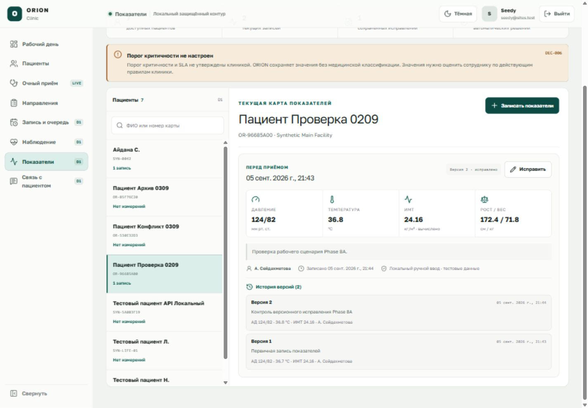
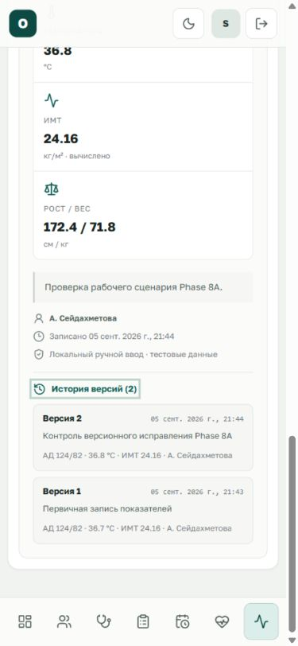
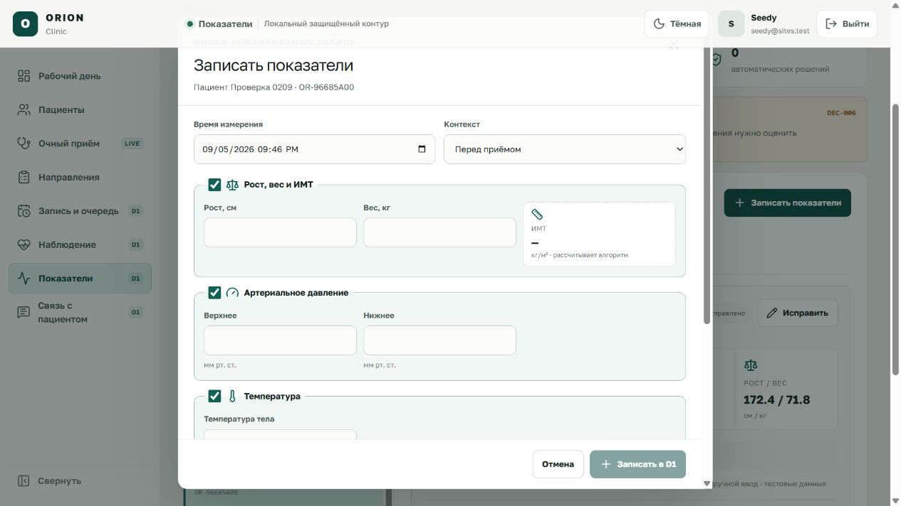

# ORION Clinic — показатели пациента

Раздел `/observations` — локальный синтетический срез Phase 8A. Он сохраняет
рост, вес, рассчитанный ИМТ, артериальное давление и температуру в D1. Каждое
исправление создаёт новую неизменяемую версию с автором, временем, причиной и
источником; прежнее значение остаётся в истории.

> Порог критичности и SLA клиникой пока не утверждены (`DEC-006`). ORION не
> ставит диагноз, не присваивает цвет риска, не уведомляет больницу и не запускает
> перевод пациента. Не вводите реальные сведения пациентов.

## 1. Что уже работает

- поиск и выбор доступной искусственной карточки пациента в текущем филиале;
- ручная запись одной или нескольких полных групп измерений;
- алгоритмический расчёт ИМТ только из введённых роста и веса;
- сохранение значений в масштабированных целых единицах без ошибок плавающей
  точки: миллиметры, граммы, сотые ИМТ и тысячные градуса Цельсия;
- отдельный контекст измерения: перед приёмом, во время консультации,
  контрольное наблюдение или другой контекст;
- append-only исправление: текущая версия меняется через новую запись, а не через
  перезапись старой;
- история всех версий, источник, сотрудник, время записи и причина изменения;
- защита от двойного сохранения через idempotency key и от устаревшего
  исправления через ожидаемую версию;
- повторная серверная проверка Sites identity, активного членства, филиала, роли
  и пациента для каждой операции;
- коррелированный append-only аудит чтения, создания и исправления.

## 2. Роли и границы доступа

- врач и медсестра могут читать показатели доступного активного пациента своего
  филиала и создавать ручную запись;
- врач может исправить текущую запись в доступном филиале;
- медсестра может исправить только ту текущую запись, которую записала сама;
- другая организация, филиал, неактивный пациент, неактивное членство и
  неподдерживаемая роль отклоняются без раскрытия чужих данных;
- прямое изменение или удаление записи/версии блокируется ограничениями D1.

UI показывает возможности активной роли, но не является границей безопасности:
сервер выполняет те же проверки повторно.

## 3. Подготовка искусственных данных

Обычный `START_ORION.bat` применяет миграции, но не добавляет клинические
fixtures. После базовой синтетической карточки можно отдельно загрузить одну
проверочную запись показателей:

```powershell
cd "C:\Users\profm\OneDrive\Документы\ChatGPT\ORION-CLINIC"
pnpm db:seed:local
pnpm db:seed:observations:local
```

Команда `db:seed:observations:local` повторяемая: повторный запуск не создаёт
дубликаты. Она не выполняется при обычном старте и не содержит реального
пациента.

## 4. Как записать показатели

1. Откройте **«Показатели»** в общей навигации.
2. Найдите искусственного пациента по имени или номеру карты и выберите его.
3. Нажмите **«Записать показатели»** или **«Первая запись»**.
4. Проверьте время и выберите контекст измерения.
5. Оставьте включёнными только нужные группы:
   - рост и вес вводятся вместе, ИМТ рассчитывается автоматически;
   - верхнее и нижнее давление вводятся вместе, верхнее должно быть больше
     нижнего;
   - температура может быть записана отдельно.
6. При необходимости добавьте примечание и понятное основание записи.
7. Подтвердите, что используются синтетические тестовые данные.
8. Нажмите **«Записать в D1»**.

Успех подтверждается отдельным сообщением, новой карточкой и обновлённым
счётчиком. Значения не получают медицинскую оценку автоматически.

## 5. Как исправить ошибку

1. На текущей карточке нажмите **«Исправить»**.
2. Измените нужное значение и обязательно укажите содержательную причину.
3. Снова подтвердите синтетический режим.
4. Нажмите **«Сохранить новую версию»**.
5. Раскройте **«История версий»** и убедитесь, что видны и новая, и предыдущая
   версии.

Если другой сотрудник уже успел сохранить изменение, сервер отклонит устаревшую
версию. Обновите экран, сравните текущие данные и только затем создайте новое
исправление. Старую запись нельзя удалить или скрыто переписать.

## 6. Неизвестный результат и повтор команды

Если соединение оборвалось после нажатия кнопки, результат может быть неизвестен:

1. не вводите значения заново в другой карточке;
2. обновите экран и проверьте текущую версию;
3. при необходимости повторите исходную команду — форма сохраняет тот же
   idempotency key до получения однозначного ответа;
4. другое содержание с уже использованным ключом будет отклонено как конфликт.

## 7. Что намеренно не реализовано

До решения клиники по `DEC-006` и `DEC-007` текущий срез не должен:

- определять «красного» пациента или интерпретировать норму/отклонение;
- автоматически ставить диагноз либо менять план лечения;
- создавать уведомление, направление, запись, очередь или госпитализацию;
- переводить пациента между больницами или создавать цифрового двойника;
- заявлять интеграцию со смотровой площадкой, КМИС, медицинским устройством или
  внешней системой мониторинга.

Такие действия требуют утверждённых порогов, владельца решения, SLA,
маршрутизации и механизма ручной отмены. До этого экран является надёжным
контуром фиксации и истории измерений, а оценку выполняет сотрудник клиники.

## 8. Пошаговая проверка локального среза

1. Запустите `START_ORION.bat` и откройте
   `http://localhost:3200/observations`.
2. Убедитесь, что видны пометки `D1`, синтетический источник и предупреждение об
   отсутствии порога критичности.
3. Выберите пациента без измерений, откройте форму, заполните минимум одну полную
   группу и сохраните.
4. Обновите страницу: карточка и значения должны сохраниться.
5. Сверьте ИМТ с расчётом `вес / рост²`; пользователь не может редактировать
   рассчитанное значение напрямую.
6. Исправьте одно значение с причиной. Текущая карточка должна показать версию
   2, а история — версии 2 и 1.
7. Попробуйте неполную пару роста/веса или давления: сохранение должно быть
   заблокировано.
8. Откройте чужой филиал или несуществующий идентификатор через URL/API:
   ожидается отказ без чужих данных.
9. Проверьте ширину 390 px: навигация остаётся доступной снизу, горизонтальной
   прокрутки страницы нет.

## 9. Проверенные экраны



На desktop одновременно видны список пациентов, крупные значения, происхождение,
кнопка исправления и история. Предупреждение `DEC-006` отделяет сохранённые факты
от ещё не утверждённой медицинской интерпретации.



На ширине 390 px секции переходят в одну колонку, а основная навигация остаётся
закреплена снизу. Проверенный документ и `body` не выходят за ширину viewport.



Форма явно разделяет группы измерений, показывает рассчитанный ИМТ и требует
отдельного подтверждения синтетического режима. Сохранение недоступно, пока
обязательные пары и подтверждение не заполнены.
