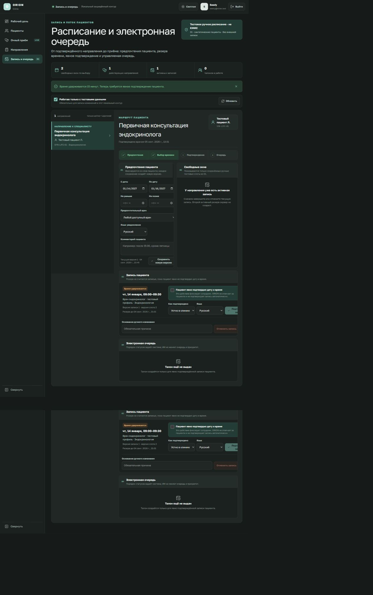
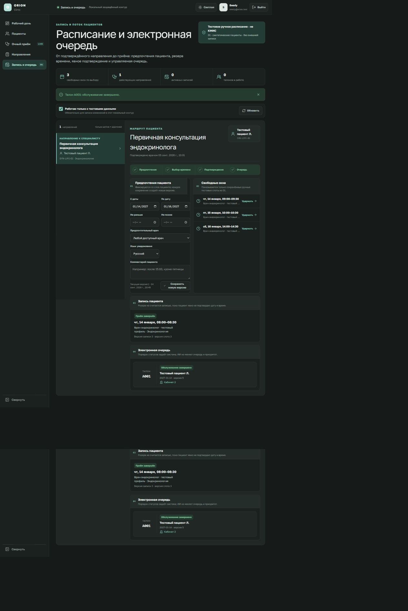

# ORION Clinic — запись и электронная очередь

Этот раздел описывает локальный синтетический срез Phase 5 на странице
`/scheduling`. Он предназначен для проверки рабочего процесса и не подключён к
КМИС, регистратуре или реальному расписанию клиники. На экране и в каждой записи
источника отображается метка **«Тестовое ручное расписание · не КМИС»**.

> Не вводите данные реального пациента. Свободные окна в текущем checkpoint
> созданы локальным seed-файлом и не подтверждают доступность врача в клинике.
> AI не создаёт, не скрывает и не ранжирует слоты.

## 1. Кто может работать с разделом

- врач и регистратор могут открыть расписание, сохранить предпочтения пациента,
  удержать время, подтвердить или отменить запись и выдать талон;
- врач может провести талон через весь клинический путь до завершения услуги;
- регистратор может зафиксировать прибытие, вызвать пациента и передать ситуацию
  на ручную проверку, но не может отметить начало или завершение медицинской
  услуги;
- все команды заново проверяют Sites identity, активное членство, организацию и
  филиал. Чужие сущности возвращаются как недоступные без раскрытия их наличия.

## 2. Подготовка локальных данных

Обычный `START_ORION.bat` применяет миграции, но не добавляет клинические
fixtures. Для первого локального показа администратор запускает отдельно:

```powershell
cd "C:\Users\profm\OneDrive\Документы\ChatGPT\ORION-CLINIC"
pnpm db:seed:local
pnpm db:seed:scheduling:local
```

Обе команды используют только искусственные записи и допускают повторный запуск.
Активная D1-база не очищается.

## 3. Запись по подтверждённому направлению

1. Откройте **«Запись и очередь»** в левой навигации.
2. Выберите филиал, если доступно несколько членств.
3. Выберите действующее направление. В список попадают только направления типа
   `referral`, отдельно подтверждённые врачом и разрешённые текущим согласием.
4. Подтвердите, что работаете только с тестовыми данными.
5. Укажите диапазон дат, при необходимости время, врача, язык уведомления и
   пожелания пациента. Кнопка **«Сохранить новую версию»** создаёт неизменяемый
   снимок; прежняя версия остаётся в истории.
6. Выберите свободный слот. Сервер проверит актуальную версию слота и создаст
   резерв на 15 минут. Два конкурентных запроса не могут занять один слот.



7. Получите явное решение пациента, выберите способ и язык подтверждения и
   отметьте соответствующий флажок. Сервер заново вычисляет и сохраняет SHA-256
   канонической формулировки вместе с её версией, а не доверяет одной визуальной
   отметке или готовому хешу из браузера.
8. Нажмите **«Подтвердить запись»**. Просроченный либо конкурентно изменённый
   резерв не подтверждается; загрузите состояние заново.

## 4. Электронная очередь

1. Для подтверждённой записи нажмите **«Выдать электронный талон»**.
2. Зафиксируйте состояния последовательно: **прибыл → вызван → приём начат →
   завершён**. Для вызова и начала услуги укажите кабинет.
3. Каждое изменение требует текстового основания, ожидаемой версии и уникального
   idempotency key. Точный повтор возвращает прежний результат, а повтор с другим
   содержимым отклоняется.
4. Кнопка ручной проверки переводит талон в терминальное состояние `exception` и
   сохраняет код и описание проблемы. Это не скрытая автоматическая коррекция.



## 5. Отмена и неявка

- резерв или подтверждённую запись можно отменить только с обязательной причиной;
- отмена возвращает слот в доступное состояние и отменяет незавершённый талон;
- **«Пациент не пришёл»** доступно только для подтверждённой записи и также
  требует основания;
- история не перезаписывается: запись, слот и талон получают новые неизменяемые
  версии, а действия попадают в аудит;
- перенос и лист ожидания в текущем checkpoint ещё не реализованы. Для нового
  времени отмените существующую тестовую запись и создайте новую, сохранив причину.

## 6. Ошибки и неизвестный результат

| Сообщение | Что означает | Что делать |
| --- | --- | --- |
| Состояние изменилось | Другой запрос уже продвинул версию записи, слота или талона | Обновить экран и работать с новой версией |
| Направление или объект недоступны | Нет нужного статуса, согласия, роли или филиального доступа | Не подбирать другую запись вручную; проверить направление и доступ |
| Резерв истёк | 15 минут закончились до подтверждения | Обновить экран; сотрудник должен отменить/освободить резерв либо дождаться доверенного cleanup после его реализации |
| Результат команды неизвестен | Связь оборвалась после отправки | Повторить ту же команду с тем же idempotency key; не создавать новую операцию вслепую |
| Требуется ручная проверка | Сотрудник зафиксировал исключение очереди | Разрешить ситуацию вне автоматического маршрута и сохранить основание |

## 7. Проверенные границы checkpoint

Локально проверены D1-модели специальности, услуги, врача, расписания, слота,
предпочтений, записи и очереди; optimistic concurrency; запрет двойного резерва;
точный idempotent replay; отмена с освобождением слота; разграничение врача и
регистратора; филиальная изоляция; аудит чтения и команд; а также полный
пользовательский путь в браузере.

Не реализованы и не заявляются готовыми:

- чтение реальной доступности, запись или сверка с КМИС;
- автоматические SMS, WhatsApp, Telegram или голосовые уведомления;
- утверждённые правила переполнения, приоритета, переноса и листа ожидания;
- доверенный фоновый worker, автоматически освобождающий просроченные резервы;
- production identity, реальные медицинские данные и эксплуатационная валидация.

До появления внешнего source-of-truth любой слот остаётся явно маркированным
ручным тестовым источником. AI не принимает решение о записи и не меняет очередь.
